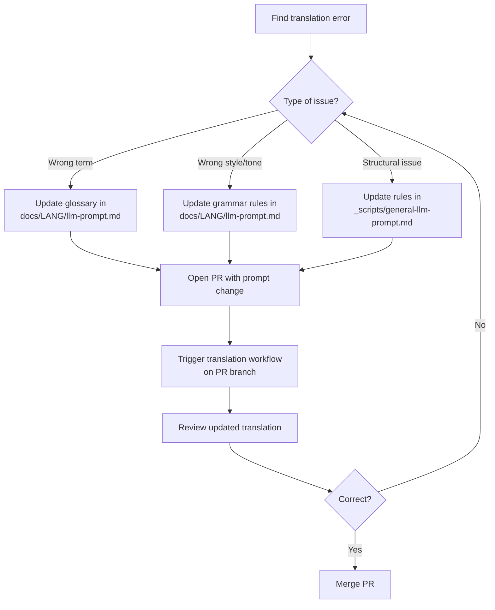
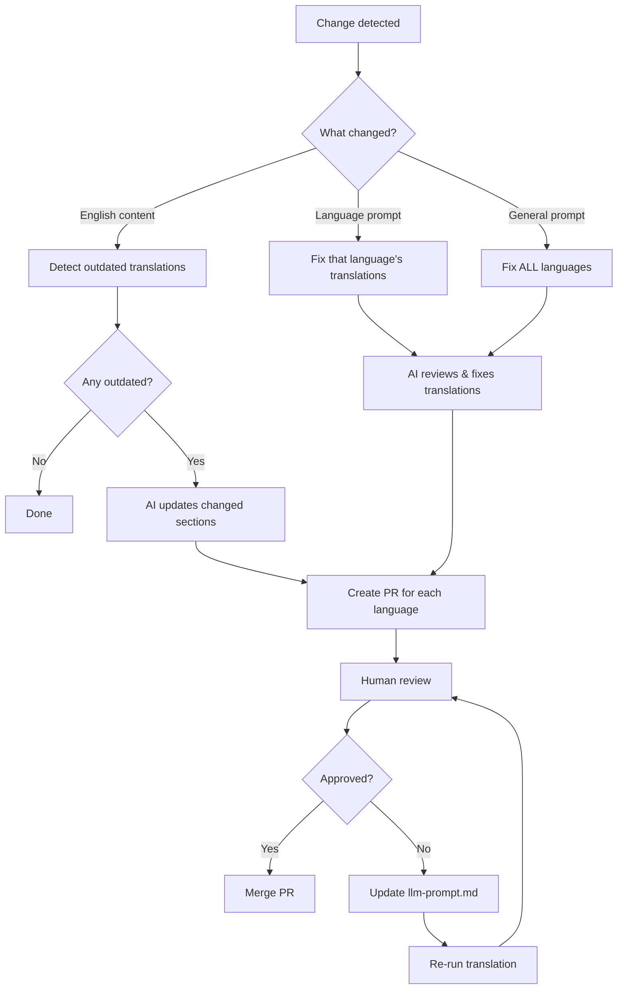
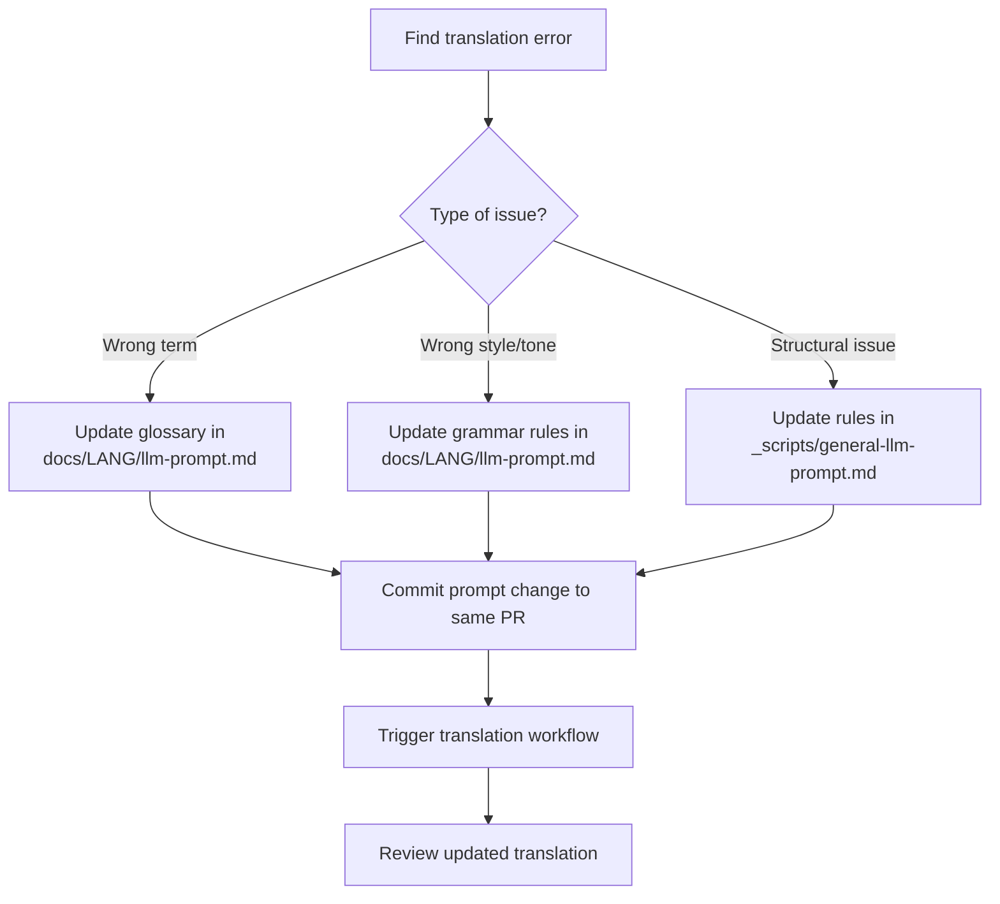

# Translation Guide

This document describes how translations work for the Nextflow training materials.

<!-- prettier-ignore-start -->
> [!WARNING]
> **All translations are generated and maintained by AI.**
> Do not submit manual translations - they will be overwritten by automated updates.
> Instead, improve the translation prompts to fix issues permanently.
<!-- prettier-ignore-end -->

## Overview

Translations are managed through a combination of:

1. **LLM prompts** that define translation rules and glossaries
2. **GitHub Actions** that automatically regenerate translations
3. **Human review** to catch errors and improve prompts

The key insight: **to fix a translation, fix the prompt** - not the translated file.

### Contents

- [How to Improve Existing Translations](#how-to-improve-existing-translations)
- [How Automatic Translation Updates Work](#how-automatic-translation-updates-work)
- [Reviewing Translation PRs](#reviewing-translation-prs)
- [How to Add a Missing Course](#how-to-add-a-missing-course)
- [How to Add a New Language](#how-to-add-a-new-language)
- [Directory Structure](#directory-structure)
- [CLI Reference (For Maintainers)](#cli-reference-for-maintainers)

---

## How to Improve Existing Translations

Found a translation error or want to suggest an improvement? Here's how to fix it the right way.



> [!NOTE]
> The translation workflow can only run on branches in the main repository, not on forks.
> If you'd like to contribute translation improvements and need write access, please open an issue to request it.

### The Right Way: Update the Prompt

The **only** sustainable way to fix translations is to improve the LLM prompts:

1. **For language-specific issues** (terminology, tone, grammar):

   - Edit `docs/<lang>/llm-prompt.md`
   - Add glossary terms, clarify rules, provide examples

2. **For structural issues** (code blocks, formatting, links):

   - Edit `_scripts/general-llm-prompt.md`
   - Add rules with before/after examples

3. **Re-run the translation** via GitHub Actions:

   - Go to **Actions** → **Translate** → **Run workflow**
   - Select language and command (`sync`)

4. **Submit a PR** with both the prompt change and regenerated translation

### Why Not Edit Translations Directly?

- Direct edits are **overwritten** when English content changes
- There's no way to track why a translation differs from the AI output
- Future maintainers won't know which changes were intentional
- The same error will reappear in new content

### Reporting Issues

If you find errors but can't fix the prompts yourself:

1. Open a GitHub issue
2. Include: language, file path, current text, expected text
3. Explain why the current translation is wrong
4. A maintainer will update the prompt and re-run

---

## Understanding the Translation Prompts

The translation system uses two types of prompts:

### General Prompt (`_scripts/general-llm-prompt.md`)

Contains rules that apply to ALL languages:

- What to translate vs keep in English
- Code block handling (never translate syntax, always translate comments)
- Formatting preservation (links, anchors, admonitions)
- Technical term lists (Nextflow keywords, operators, directives)
- Validation requirements

### Language-Specific Prompts (`docs/<lang>/llm-prompt.md`)

Contains rules specific to each language:

- Grammar and tone (formal/informal)
- Terms that get translated (with exact translations)
- Admonition titles
- Common expressions
- Language-specific mistakes to avoid

### Prompt Precedence

When prompts conflict, **language-specific rules override general rules**. This allows languages to customize behavior (e.g., French keeps "workflow" in English even though it could theoretically be translated).

### Contributing Prompt Improvements

If you're a native speaker and want to improve translation quality:

1. **Read the current prompt** for your language in `docs/<lang>/llm-prompt.md`
2. **Identify the issue type**:
   - Wrong term → Add/update entry in "Terms to Translate"
   - Wrong tone → Clarify in "Grammar & Tone" section
   - Repeated error → Add to "Common Mistakes" section
3. **Provide examples** showing wrong vs correct translations
4. **Test your change** by running the translation workflow
5. **Submit a PR** with both prompt change and sample output

Good prompt improvements include:

- Adding missing glossary terms
- Clarifying ambiguous rules with examples
- Adding common mistakes that keep occurring
- Regional spelling/grammar preferences

---

## How Automatic Translation Updates Work

Translations are automatically updated via GitHub Actions when:

1. **English source files change** → Outdated translations are updated
2. **Translation prompts change** → Existing translations are fixed to comply with new guidelines



### Key Points

- The AI makes **minimal changes**, updating only sections that changed in English
- Translations preserve line-by-line structure for easy diff review
- Each language gets a separate PR for independent review/merge
- The system uses git commit timestamps to detect outdated files
- **Prompt changes trigger automatic re-translation** of affected files

---

## Reviewing Translation PRs

When reviewing a translation PR (whether automatic or triggered manually), follow these guidelines:

### What to Check

1. **Technical accuracy**

   - Are Nextflow concepts correctly explained?
   - Are code examples unchanged (only comments translated)?
   - Are technical terms used consistently with the glossary?

2. **Formatting preservation**

   - Are code blocks intact and properly formatted?
   - Are admonitions (note, tip, warning) correctly structured?
   - Are heading anchors preserved (`{ #anchor-name }`)?
   - Are links working (URLs unchanged, only link text translated)?

3. **Language quality**
   - Is the tone appropriate (formal/informal per language)?
   - Are translations natural and readable?
   - Are there any obvious errors or awkward phrasings?

### How to Handle Issues

<!-- prettier-ignore-start -->
> [!CAUTION]
> **Do NOT suggest changes directly to translation PRs.**
> Direct edits will be overwritten on the next automatic update.
> Instead, update the translation prompts and re-run the translation.
<!-- prettier-ignore-end -->

When you find an issue during review:



#### Workflow for Fixing Issues

1. **Edit the appropriate prompt file** in the same PR branch:

   - Language-specific issues → `docs/<lang>/llm-prompt.md`
   - General formatting issues → `_scripts/general-llm-prompt.md`

2. **Trigger the translation workflow** to regenerate:

   - Go to **Actions** → **Translate** → **Run workflow**
   - Select the language and `sync`
   - Target the PR branch (not `master`)

3. **Review the updated translation** to verify the fix

4. **Approve and merge** once the translation is correct

#### Example: Fixing a Wrong Term

If "workflow" is incorrectly translated as "flujo" instead of "flujo de trabajo" in Spanish:

1. In the PR branch, edit `docs/es/llm-prompt.md`
2. Add or update the glossary entry:

   | English  | Spanish                        |
   | -------- | ------------------------------ |
   | workflow | flujo de trabajo (NOT "flujo") |

3. Run the translation workflow targeting this branch
4. Verify the fix in the updated PR

### Approving PRs

Once you've verified the translation quality:

1. Check that CI passes (build succeeds)
2. Approve the PR
3. Merge (squash merge recommended)

---

## How to Add a Missing Course

If a language exists but is missing content (e.g., Portuguese has `hello_nextflow/` but not `nf4_science/`):

### Using GitHub Actions (Recommended)

1. Go to **Actions** → **Translate** → **Run workflow**
2. Select language (e.g., `pt`)
3. Select command: `sync`
4. The workflow creates a PR with translations

### Using the CLI (Requires API Key)

For maintainers with `ANTHROPIC_API_KEY` access:

```bash
cd _scripts

# Preview what needs translating
uv run translate.py sync pt --dry-run

# Translate one file at a time
uv run translate.py translate nf4_science/index.md --lang pt

# Or sync all (update outdated + add missing + remove orphaned)
uv run translate.py sync pt
```

### After Translation

1. Review the generated translations
2. Check if any prompt updates are needed
3. Submit a PR

---

## How to Add a New Language

### Step 1: Create Language Structure

Use the GitHub Actions workflow or CLI:

```bash
cd _scripts
uv run python docs.py new-lang <lang-code>
```

This creates:

- `docs/<lang>/mkdocs.yml` - MkDocs config
- `docs/<lang>/llm-prompt.md` - Translation prompt (requires customization)
- `docs/<lang>/docs/.gitkeep` - Placeholder

### Step 2: Customize the Translation Prompt

Edit `docs/<lang>/llm-prompt.md` to define:

1. **Grammar preferences**

   - Formal or informal tone
   - Regional spelling conventions
   - Specific grammar rules

2. **Glossary**

   - Terms to keep in English
   - Terms to translate (with exact translations)
   - Common mistakes to avoid

3. **Admonition titles**
   - Translations for Note, Tip, Warning, Exercise, Solution

See existing language prompts for examples (e.g., `docs/pt/llm-prompt.md`).

### Step 3: Register the Language

Add the language code to:

1. `docs/language_names.yml` - map code to language name
2. `docs/en/mkdocs.yml` - `extra.alternate` for language switcher

### Step 4: Generate Initial Translations

Use GitHub Actions:

1. Go to **Actions** → **Translate** → **Run workflow**
2. Select the new language
3. Select command: `sync`

### Step 5: Review and Iterate

1. Review the PR with generated translations
2. Update `llm-prompt.md` to fix any issues
3. Re-run translations as needed
4. Merge when satisfied

---

## Directory Structure

```
docs/
├── en/                     # English (source)
│   ├── mkdocs.yml          # Main config
│   ├── overrides/          # Theme customization
│   └── docs/               # English content
├── pt/                     # Portuguese
│   ├── mkdocs.yml          # Inherits from en
│   ├── llm-prompt.md       # Translation rules
│   └── docs/               # Translated content
├── es/                     # Spanish
│   └── ...
└── ...

_scripts/
├── translate.py            # Translation CLI
├── general-llm-prompt.md   # Shared translation rules
└── docs.py                 # Build/serve CLI
```

## CLI Reference (For Maintainers)

> [!NOTE]
> The CLI requires `ANTHROPIC_API_KEY` for translation commands.
> Community contributors should use GitHub Actions instead.

All commands run from `_scripts/` directory:

```bash
cd _scripts
```

### Translation Commands

```bash
# Preview what sync would do (no API key required)
uv run translate.py sync <lang> --dry-run

# Sync all translations (update outdated + add missing + remove orphaned)
uv run translate.py sync <lang>

# Sync with lower parallelism (default: 50 concurrent translations)
uv run translate.py sync <lang> --parallel 10

# Sync with filter pattern
uv run translate.py sync <lang> --include hello_nextflow

# Translate a single file
uv run translate.py translate <path> --lang <lang>
```

### Preview Commands (No API key required)

```bash
# Serve docs locally
uv run docs.py serve <lang>

# Build docs
uv run docs.py build-lang <lang>
```

---

## References

- [FastAPI Translation System](https://github.com/fastapi/fastapi/tree/master/scripts) - Inspiration for this implementation
- [Portuguese Glossary](https://docs.google.com/spreadsheets/d/1HUa3BO2kwukhX4EXQ-1blXeP5iueUdM23OwDRpfarDg/edit)
