# Parte 5: Validazione degli input

<span class="ai-translation-notice">:material-information-outline:{ .ai-translation-notice-icon } Traduzione assistita da IA - [scopri di più e suggerisci miglioramenti](https://github.com/nextflow-io/training/blob/master/TRANSLATING.md)</span>

In questa quinta parte del corso di formazione Hello nf-core, mostriamo come utilizzare il plugin nf-schema per validare gli input e i parametri della pipeline.

??? info "Come iniziare da questa sezione"

    Questa sezione presuppone che abbiate completato la [Parte 4: Creare un modulo nf-core](./04_make_module.md) e che abbiate aggiornato il modulo del processo `COWPY` agli standard nf-core nella vostra pipeline.

    Se non avete completato la Parte 4 o desiderate ripartire da zero per questa parte, potete utilizzare la soluzione `core-hello-part4` come punto di partenza.
    Eseguite questi comandi dall'interno della directory `hello-nf-core/`:

    ```bash
    cp -r solutions/core-hello-part4 core-hello
    cd core-hello
    ```

    Questo vi fornisce una pipeline con il modulo `COWPY` già aggiornato per seguire gli standard nf-core.
    Potete verificare che venga eseguita con successo eseguendo il seguente comando:

    ```bash
    nextflow run . --outdir core-hello-results -profile test,docker --validate_params false
    ```

---

## 0. Riscaldamento: Un po' di contesto

### 0.1. Perché la validazione è importante

Immaginate di eseguire la vostra pipeline per due ore, solo per vederla interrompersi perché un utente ha fornito un file con l'estensione sbagliata. O di passare ore a debuggare errori criptici, solo per scoprire che un parametro era scritto in modo errato. Senza validazione degli input, questi scenari sono comuni.

Considerate questo esempio:

```console title="Senza validazione"
$ nextflow run my-pipeline --input data.txt --output results

...2 ore dopo...

ERROR ~ No such file: 'data.fq.gz'
  Expected FASTQ format but received TXT
```

La pipeline ha accettato input non validi ed è stata eseguita per ore prima di fallire. Con una validazione adeguata:

```console title="Con validazione"
$ nextflow run my-pipeline --input data.txt --output results

ERROR ~ Validation of pipeline parameters failed!

 * --input (data.txt): File extension '.txt' does not match required pattern '.fq.gz' or '.fastq.gz'
 * --output: required parameter is missing (expected: --outdir)

Pipeline failed before execution - please fix the errors above
```

La pipeline fallisce immediatamente con messaggi di errore chiari e attuabili. Questo risparmia tempo, risorse di calcolo e frustrazione.

### 0.2. Il plugin nf-schema

Il [plugin nf-schema](https://nextflow-io.github.io/nf-schema/latest/) è un plugin Nextflow che fornisce capacità di validazione complete per le pipeline Nextflow.
Sebbene nf-schema funzioni con qualsiasi workflow Nextflow, è la soluzione di validazione standard per tutte le pipeline nf-core.

nf-schema fornisce diverse funzioni chiave:

- **Validazione dei parametri**: Valida i parametri della pipeline rispetto a `nextflow_schema.json`
- **Validazione del sample sheet**: Valida i file di input rispetto a `assets/schema_input.json`
- **Conversione dei canali**: Converte i sample sheet validati in canali Nextflow
- **Generazione del testo di aiuto**: Genera automaticamente l'output `--help` dalle definizioni dello schema
- **Riepilogo dei parametri**: Mostra quali parametri differiscono dai valori predefiniti

nf-schema è il successore del plugin nf-validation deprecato e utilizza lo standard [JSON Schema Draft 2020-12](https://json-schema.org/) per la validazione.

??? info "Cosa sono i plugin Nextflow?"

    I plugin sono estensioni che aggiungono nuove funzionalità al linguaggio Nextflow stesso. Vengono installati tramite un blocco `plugins{}` in `nextflow.config` e possono fornire:

    - Nuove funzioni e classi che possono essere importate (come `samplesheetToList`)
    - Nuove funzionalità DSL e operatori
    - Integrazione con servizi esterni

    Il plugin nf-schema è specificato in `nextflow.config`:

    ```groovy
    plugins {
        id 'nf-schema@2.1.1'
    }
    ```

    Una volta installato, potete importare funzioni dai plugin utilizzando la sintassi `include { functionName } from 'plugin/plugin-name'`.

### 0.3. Due file schema per due tipi di validazione

Una pipeline nf-core utilizzerà due file schema separati, che corrispondono a due tipi di validazione:

| File Schema                | Scopo                      | Valida                                                    |
| -------------------------- | -------------------------- | --------------------------------------------------------- |
| `nextflow_schema.json`     | Validazione dei parametri  | Flag da riga di comando: `--input`, `--outdir`, `--batch` |
| `assets/schema_input.json` | Validazione dei dati input | Contenuto dei sample sheet e dei file di input            |

Entrambi gli schema utilizzano il formato JSON Schema, uno standard ampiamente adottato per descrivere e validare strutture di dati.

**La validazione dei parametri** valida i parametri da riga di comando (flag come `--outdir`, `--batch`, `--input`):

- Controlla i tipi, gli intervalli e i formati dei parametri
- Assicura che i parametri richiesti siano forniti
- Valida che i percorsi dei file esistano
- Definita in `nextflow_schema.json`

**La validazione dei dati input** valida la struttura dei sample sheet e dei file manifest (file CSV/TSV che descrivono i vostri dati):

- Controlla la struttura delle colonne e i tipi di dati
- Valida che i percorsi dei file referenziati nel sample sheet esistano
- Assicura che i campi richiesti siano presenti
- Definita in `assets/schema_input.json`

!!! warning "Cosa NON fa la validazione dei dati input"

    La validazione dei dati input controlla la struttura dei *file manifest* (sample sheet, file CSV), NON il contenuto dei vostri file di dati effettivi (FASTQ, BAM, VCF, ecc.).

    Per dati su larga scala, la validazione del contenuto dei file (come il controllo dell'integrità dei BAM) dovrebbe avvenire nei processi della pipeline in esecuzione sui nodi worker, non durante la fase di validazione sulla macchina orchestratrice.

### 0.4. Quando dovrebbe avvenire la validazione?

```mermaid
graph LR
    A[L'utente esegue la pipeline] --> B[Validazione dei parametri]
    B -->|✓ Valido| C[Validazione dei dati input]
    B -->|✗ Non valido| D[Errore: Correggere i parametri]
    C -->|✓ Valido| E[La pipeline viene eseguita]
    C -->|✗ Non valido| F[Errore: Correggere i dati input]
```



La validazione dovrebbe avvenire **prima** che qualsiasi processo della pipeline venga eseguito, per fornire un feedback rapido e prevenire tempo di calcolo sprecato.

Ora applichiamo questi principi nella pratica, iniziando con la validazione dei parametri.

---

## 1. Validazione dei parametri (nextflow_schema.json)

Iniziamo aggiungendo la validazione dei parametri alla nostra pipeline. Questo valida i flag da riga di comando come `--input`, `--outdir` e `--batch`.

### 1.1. Configurare la validazione per saltare la validazione del file di input

Il template della pipeline nf-core viene fornito con nf-schema già installato e configurato:

- Il plugin nf-schema è installato tramite il blocco `plugins{}` in `nextflow.config`
- La validazione dei parametri è abilitata per impostazione predefinita tramite `params.validate_params = true`
- La validazione viene eseguita dal subworkflow `UTILS_NFSCHEMA_PLUGIN` durante l'inizializzazione della pipeline

Il comportamento della validazione è controllato tramite lo scope `validation{}` in `nextflow.config`.

Poiché lavoreremo prima sulla validazione dei parametri (questa sezione) e non configureremo lo schema dei dati input fino alla sezione 2, dobbiamo temporaneamente dire a nf-schema di saltare la validazione del contenuto del file del parametro `input`.

Aprite `nextflow.config` e trovate il blocco `validation` (intorno alla riga 246). Aggiungete `ignoreParams` per saltare la validazione del file di input:

=== "Dopo"

    ```groovy title="nextflow.config" hl_lines="3" linenums="246"
    validation {
        defaultIgnoreParams = ["genomes"]
        ignoreParams = ['input']
        monochromeLogs = params.monochrome_logs
    }
    ```

=== "Prima"

    ```groovy title="nextflow.config" linenums="246"
    validation {
        defaultIgnoreParams = ["genomes"]
        monochromeLogs = params.monochrome_logs
    }
    ```

Questa configurazione dice a nf-schema di:

- **`defaultIgnoreParams`**: Saltare la validazione di parametri complessi come `genomes` (impostato dagli sviluppatori del template)
- **`ignoreParams`**: Saltare la validazione del contenuto del file del parametro `input` (temporaneo; riabiliteremo questo nella sezione 2)
- **`monochromeLogs`**: Disabilitare l'output colorato nei messaggi di validazione quando impostato su `true` (controllato da `params.monochrome_logs`)

!!! note "Perché ignorare il parametro input?"

    Il parametro `input` in `nextflow_schema.json` ha `"schema": "assets/schema_input.json"` che dice a nf-schema di validare il *contenuto* del file CSV di input rispetto a quello schema.
    Poiché non abbiamo ancora configurato quello schema, ignoriamo temporaneamente questa validazione.
    Rimuoveremo questa impostazione nella sezione 2 dopo aver configurato lo schema dei dati input.

### 1.2. Esaminare lo schema dei parametri

Diamo un'occhiata a una sezione del file `nextflow_schema.json` che è venuto con il nostro template della pipeline:

```bash
grep -A 25 '"input_output_options"' nextflow_schema.json
```

Lo schema dei parametri è organizzato in gruppi. Ecco il gruppo `input_output_options`:

```json title="core-hello/nextflow_schema.json (estratto)" linenums="8"
        "input_output_options": {
            "title": "Input/output options",
            "type": "object",
            "fa_icon": "fas fa-terminal",
            "description": "Define where the pipeline should find input data and save output data.",
            "required": ["input", "outdir"],
            "properties": {
                "input": {
                    "type": "string",
                    "format": "file-path",
                    "exists": true,
                    "schema": "assets/schema_input.json",
                    "mimetype": "text/csv",
                    "pattern": "^\\S+\\.csv$",
                    "description": "Path to comma-separated file containing information about the samples in the experiment.",
                    "help_text": "You will need to create a design file with information about the samples in your experiment before running the pipeline. Use this parameter to specify its location. It has to be a comma-separated file with 3 columns, and a header row.",
                    "fa_icon": "fas fa-file-csv"
                },
                "outdir": {
                    "type": "string",
                    "format": "directory-path",
                    "description": "The output directory where the results will be saved. You have to use absolute paths to storage on Cloud infrastructure.",
                    "fa_icon": "fas fa-folder-open"
                }
            }
        },
```

Ogni input descritto qui ha le seguenti proprietà chiave che possono essere validate:

- **`type`**: Tipo di dato (string, integer, boolean, number)
- **`format`**: Formati speciali come `file-path` o `directory-path`
- **`exists`**: Per i percorsi di file, controlla se il file esiste
- **`pattern`**: Espressione regolare che il valore deve corrispondere
- **`required`**: Array di nomi di parametri che devono essere forniti
- **`mimetype`**: Mimetype del file atteso per la validazione

Se avete un occhio attento, potreste notare che il parametro input `batch` che abbiamo usato non è ancora definito nello schema.
Lo aggiungeremo nella prossima sezione.

??? info "Da dove provengono i parametri dello schema?"

    La validazione dello schema utilizza `nextflow.config` come base per le definizioni dei parametri.
    I parametri dichiarati altrove negli script del vostro workflow (come in `main.nf` o nei file dei moduli) **non** vengono automaticamente rilevati dal validatore dello schema.

    Questo significa che dovreste sempre dichiarare i parametri della vostra pipeline in `nextflow.config`, e poi definire le loro regole di validazione in `nextflow_schema.json`.

### 1.3. Aggiungere il parametro batch

Sebbene lo schema sia un file JSON che può essere modificato manualmente, **la modifica manuale è soggetta a errori e non è consigliata**.
Invece, nf-core fornisce uno strumento GUI interattivo che gestisce la sintassi JSON Schema per voi e valida le vostre modifiche:

```bash
nf-core pipelines schema build
```

Dovreste vedere qualcosa del genere:

```console
                                      ,--./,-.
      ___     __   __   __   ___     /,-._.--\
|\ | |__  __ /  ` /  \ |__) |__         }  {
| \| |       \__, \__/ |  \ |___     \`-._,-`-,
                                      `._,._,'

nf-core/tools version 3.4.1 - https://nf-co.re

INFO     [✓] Default parameters match schema validation
INFO     [✓] Pipeline schema looks valid (found 17 params)
INFO     Writing schema with 17 params: 'nextflow_schema.json'
🚀  Launch web builder for customisation and editing? [y/n]:
```

Digitate `y` e premete Invio per avviare l'interfaccia web interattiva.

Il vostro browser si aprirà mostrando il costruttore dello schema dei parametri:


Per aggiungere il parametro `batch`:

1. Cliccate sul pulsante **"Add parameter"** in alto
2. Utilizzate la maniglia di trascinamento (⋮⋮) per spostare il nuovo parametro verso l'alto nel gruppo "Input/output options", sotto il parametro `input`
3. Compilate i dettagli del parametro:
   - **ID**: `batch`
   - **Description**: `Name for this batch of greetings`
   - **Type**: `string`
   - **Required**: spuntate la casella
   - Opzionalmente, selezionate un'icona dal selettore di icone (ad es., `fas fa-layer-group`)


Quando avete finito, cliccate sul pulsante **"Finished"** in alto a destra.

Tornando al vostro terminale, vedrete:

```console
INFO     Writing schema with 18 params: 'nextflow_schema.json'
⣾ Use ctrl+c to stop waiting and force exit.
```

Premete `Ctrl+C` per uscire dal costruttore dello schema.

Lo strumento ha ora aggiornato il vostro file `nextflow_schema.json` con il nuovo parametro `batch`, gestendo correttamente tutta la sintassi JSON Schema.

### 1.4. Verificare le modifiche

```bash
grep -A 25 '"input_output_options"' nextflow_schema.json
```

```json title="core-hello/nextflow_schema.json (estratto)" linenums="8" hl_lines="19-23"
    "input_output_options": {
      "title": "Input/output options",
      "type": "object",
      "fa_icon": "fas fa-terminal",
      "description": "Define where the pipeline should find input data and save output data.",
      "required": ["input", "outdir", "batch"],
      "properties": {
        "input": {
          "type": "string",
          "format": "file-path",
          "exists": true,
          "schema": "assets/schema_input.json",
          "mimetype": "text/csv",
          "pattern": "^\\S+\\.csv$",
          "description": "Path to comma-separated file containing information about the samples in the experiment.",
          "help_text": "You will need to create a design file with information about the samples in your experiment before running the pipeline. Use this parameter to specify its location. It has to be a comma-separated file with 3 columns, and a header row.",
          "fa_icon": "fas fa-file-csv"
        },
        "batch": {
          "type": "string",
          "description": "Name for this batch of greetings",
          "fa_icon": "fas fa-layer-group"
        },
```

Dovreste vedere che il parametro `batch` è stato aggiunto allo schema con il campo "required" che ora mostra `["input", "outdir", "batch"]`.

### 1.5. Testare la validazione dei parametri

Ora testiamo che la validazione dei parametri funzioni correttamente.

Prima, provate a eseguire senza il parametro `input` richiesto:

```bash
nextflow run . --outdir test-results -profile docker
```

??? warning "Output del comando"

    ```console
    ERROR ~ Validation of pipeline parameters failed!

    -- Check '.nextflow.log' file for details
    The following invalid input values have been detected:

    * Missing required parameter(s): input, batch
    ```

Perfetto! La validazione rileva il parametro richiesto mancante prima che la pipeline venga eseguita.

Ora provate con un set valido di parametri:

```bash
nextflow run . --input assets/greetings.csv --outdir results --batch my-batch -profile test,docker
```

??? success "Output del comando"

    ```console
     N E X T F L O W   ~  version 25.04.3

    Launching `./main.nf` [peaceful_wozniak] DSL2 - revision: b9e9b3b8de

    executor >  local (8)
    [de/a1b2c3] CORE_HELLO:HELLO:sayHello (3)       | 3 of 3 ✔
    [4f/d5e6f7] CORE_HELLO:HELLO:convertToUpper (3) | 3 of 3 ✔
    [8a/b9c0d1] CORE_HELLO:HELLO:CAT_CAT (test)     | 1 of 1 ✔
    [e2/f3a4b5] CORE_HELLO:HELLO:COWPY (test)       | 1 of 1 ✔
    -[core/hello] Pipeline completed successfully-
    ```

La pipeline dovrebbe essere eseguita con successo, e il parametro `batch` è ora validato.

### Takeaway

Avete imparato come utilizzare lo strumento interattivo `nf-core pipelines schema build` per aggiungere parametri a `nextflow_schema.json` e avete visto la validazione dei parametri in azione.
L'interfaccia web gestisce tutta la sintassi JSON Schema per voi, rendendo facile gestire schemi di parametri complessi senza modifiche JSON manuali soggette a errori.

### Cosa c'è dopo?

Ora che la validazione dei parametri funziona, aggiungiamo la validazione per il contenuto del file di dati input.

---

## 2. Validazione dei dati input (schema_input.json)

Aggiungeremo la validazione per il contenuto del nostro file CSV di input.
Mentre la validazione dei parametri controlla i flag da riga di comando, la validazione dei dati input assicura che i dati all'interno del file CSV siano strutturati correttamente.

### 2.1. Comprendere il formato greetings.csv

Ricordiamoci come appare il nostro input:

```bash
cat assets/greetings.csv
```

```csv title="assets/greetings.csv"
Hello,en,87
Bonjour,fr,96
Holà,es,98
```

Questo è un semplice CSV con:

- Tre colonne (nessuna intestazione)
- Su ogni riga: un saluto, una lingua e un punteggio
- Le prime due colonne sono stringhe di testo senza requisiti di formato speciali
- La terza colonna è un intero

Per la nostra pipeline, è richiesta solo la prima colonna.

### 2.2. Progettare la struttura dello schema

Per il nostro caso d'uso, vogliamo:

1. Accettare input CSV con almeno una colonna
2. Trattare il primo elemento di ogni riga come una stringa di saluto
3. Assicurarsi che i saluti non siano vuoti e non inizino con spazi
4. Assicurarsi che il campo lingua corrisponda a uno dei codici lingua supportati (en, fr, es, it, de)
5. Assicurarsi che il campo punteggio sia un intero con un valore compreso tra 0 e 100

Struttureremo questo come un array di oggetti, dove ogni oggetto ha almeno un campo `greeting`.

### 2.3. Aggiornare il file schema

Il template della pipeline nf-core include uno `assets/schema_input.json` predefinito progettato per dati di sequenziamento paired-end.
Dobbiamo sostituirlo con uno schema più semplice per il nostro caso d'uso dei saluti.

Aprite `assets/schema_input.json` e sostituite le sezioni `properties` e `required`:

=== "Dopo"

    ```json title="assets/schema_input.json" linenums="1" hl_lines="10-25 27"
    {
        "$schema": "https://json-schema.org/draft/2020-12/schema",
        "$id": "https://raw.githubusercontent.com/core/hello/main/assets/schema_input.json",
        "title": "core/hello pipeline - params.input schema",
        "description": "Schema for the greetings file provided with params.input",
        "type": "array",
        "items": {
            "type": "object",
            "properties": {
                "greeting": {
                    "type": "string",
                    "pattern": "^\\S.*$",
                    "errorMessage": "Greeting must be provided and cannot be empty or start with whitespace"
                },
                "language": {
                    "type": "string",
                    "enum": ["en", "fr", "es", "it", "de"],
                    "errorMessage": "Language must be one of: en, fr, es, it, de"
                },
                "score": {
                    "type": "integer",
                    "minimum": 0,
                    "maximum": 100,
                    "errorMessage": "Score must be an integer with a value between 0 and 100"
                }
            },
            "required": ["greeting"]
        }
    }
    ```

=== "Prima"

    ```json title="assets/schema_input.json" linenums="1" hl_lines="10-29 31"
    {
        "$schema": "https://json-schema.org/draft/2020-12/schema",
        "$id": "https://raw.githubusercontent.com/core/hello/main/assets/schema_input.json",
        "title": "core/hello pipeline - params.input schema",
        "description": "Schema for the file provided with params.input",
        "type": "array",
        "items": {
            "type": "object",
            "properties": {
                "sample": {
                    "type": "string",
                    "pattern": "^\\S+$",
                    "errorMessage": "Sample name must be provided and cannot contain spaces",
                    "meta": ["id"]
                },
                "fastq_1": {
                    "type": "string",
                    "format": "file-path",
                    "exists": true,
                    "pattern": "^([\\S\\s]*\\/)?[^\\s\\/]+\\.f(ast)?q\\.gz$",
                    "errorMessage": "FastQ file for reads 1 must be provided, cannot contain spaces and must have extension '.fq.gz' or '.fastq.gz'"
                },
                "fastq_2": {
                    "type": "string",
                    "format": "file-path",
                    "exists": true,
                    "pattern": "^([\\S\\s]*\\/)?[^\\s\\/]+\\.f(ast)?q\\.gz$",
                    "errorMessage": "FastQ file for reads 2 cannot contain spaces and must have extension '.fq.gz' or '.fastq.gz'"
                }
            },
            "required": ["sample", "fastq_1"]
        }
    }
    ```

Le modifiche chiave:

- **`description`**: Aggiornata per menzionare "greetings file"
- **`properties`**: Sostituite `sample`, `fastq_1` e `fastq_2` con `greeting`, `language` e `score`
  - **`type:`** Impone string (`greeting`, `language`) o integer (`score`)
  - **`pattern: "^\\S.*$"`**: Il saluto deve iniziare con un carattere non spazio (ma può contenere spazi dopo)
  - **`"enum": ["en", "fr", "es", "it", "de"]`**: Il codice lingua deve essere nel set supportato
  - **`"minimum": 0` e `"maximum": 100`**: Il valore del punteggio deve essere compreso tra 0 e 100
  - **`errorMessage`**: Messaggio di errore personalizzato mostrato se la validazione fallisce
- **`required`**: Cambiato da `["sample", "fastq_1"]` a `["greeting"]`

### 2.4. Aggiungere un'intestazione al file greetings.csv

Quando nf-schema legge un file CSV, si aspetta che la prima riga contenga intestazioni di colonne che corrispondano ai nomi dei campi nello schema.

Per il nostro caso semplice, dobbiamo aggiungere una riga di intestazione al nostro file di saluti:

=== "Dopo"

    ```csv title="assets/greetings.csv" linenums="1" hl_lines="1"
    greeting,language,score
    Hello,en,87
    Bonjour,fr,96
    Holà,es,98
    ```

=== "Prima"

    ```csv title="assets/greetings.csv" linenums="1"
    Hello,en,87
    Bonjour,fr,96
    Holà,es,98
    ```

Ora il file CSV ha una riga di intestazione che corrisponde ai nomi dei campi nel nostro schema.

Il passaggio finale è implementare la validazione nel codice della pipeline utilizzando `samplesheetToList`.

### 2.5. Implementare la validazione nella pipeline

Ora dobbiamo sostituire il nostro semplice parsing CSV con la funzione `samplesheetToList` di nf-schema, che validerà e analizzerà il samplesheet.

La funzione `samplesheetToList`:

1. Legge il sample sheet di input (CSV, TSV, JSON o YAML)
2. Lo valida rispetto allo schema JSON fornito
3. Restituisce una lista Groovy dove ogni voce corrisponde a una riga
4. Genera messaggi di errore utili se la validazione fallisce

Aggiorniamo il codice di gestione dell'input:

Aprite `subworkflows/local/utils_nfcore_hello_pipeline/main.nf` e localizzate la sezione dove creiamo il canale di input (intorno alla riga 80).

Dobbiamo:

1. Utilizzare la funzione `samplesheetToList` (già importata nel template)
2. Validare e analizzare l'input
3. Estrarre solo le stringhe di saluto per il nostro workflow

Prima, notate che la funzione `samplesheetToList` è già importata all'inizio del file (il template nf-core include questo per impostazione predefinita):

```groovy title="core-hello/subworkflows/local/utils_nfcore_hello_pipeline/main.nf" linenums="1" hl_lines="13"
//
// Subworkflow with functionality specific to the core/hello pipeline
//

/*
~~~~~~~~~~~~~~~~~~~~~~~~~~~~~~~~~~~~~~~~~~~~~~~~~~~~~~~~~~~~~~~~~~~~~~~~~~~~~~~~~~~~~~~~
    IMPORT FUNCTIONS / MODULES / SUBWORKFLOWS
~~~~~~~~~~~~~~~~~~~~~~~~~~~~~~~~~~~~~~~~~~~~~~~~~~~~~~~~~~~~~~~~~~~~~~~~~~~~~~~~~~~~~~~~
*/

include { UTILS_NFSCHEMA_PLUGIN     } from '../../nf-core/utils_nfschema_plugin'
include { paramsSummaryMap          } from 'plugin/nf-schema'
include { samplesheetToList         } from 'plugin/nf-schema'
include { paramsHelp                } from 'plugin/nf-schema'
include { completionSummary         } from '../../nf-core/utils_nfcore_pipeline'
include { UTILS_NFCORE_PIPELINE     } from '../../nf-core/utils_nfcore_pipeline'
include { UTILS_NEXTFLOW_PIPELINE   } from '../../nf-core/utils_nextflow_pipeline'
```

Ora aggiornate il codice di creazione del canale:

=== "Dopo"

    ```groovy title="core-hello/subworkflows/local/utils_nfcore_hello_pipeline/main.nf" linenums="80" hl_lines="4"
        //
        // Create channel from input file provided through params.input
        //
        ch_samplesheet = channel.fromList(samplesheetToList(params.input, "${projectDir}/assets/schema_input.json"))
            .map { line -> line[0] }

        emit:
        samplesheet = ch_samplesheet
        versions    = ch_versions
    ```

=== "Prima"

    ```groovy title="core-hello/subworkflows/local/utils_nfcore_hello_pipeline/main.nf" linenums="80" hl_lines="4 5"
        //
        // Create channel from input file provided through params.input
        //
        ch_samplesheet = channel.fromPath(params.input)
            .splitCsv()
            .map { line -> line[0] }

        emit:
        samplesheet = ch_samplesheet
        versions    = ch_versions
    ```

Analizziamo cosa è cambiato:

1. **`samplesheetToList(params.input, "${projectDir}/assets/schema_input.json")`**: Valida il file di input rispetto al nostro schema e restituisce una lista
2. **`Channel.fromList(...)`**: Converte la lista in un canale Nextflow

Questo completa l'implementazione della validazione dei dati input utilizzando `samplesheetToList` e schemi JSON.

Ora che abbiamo configurato lo schema dei dati input, possiamo rimuovere l'impostazione ignore temporanea che abbiamo aggiunto in precedenza.

### 2.6. Riabilitare la validazione dell'input

Aprite `nextflow.config` e rimuovete la riga `ignoreParams` dal blocco `validation`:

=== "Dopo"

    ```groovy title="nextflow.config" linenums="246"
    validation {
        defaultIgnoreParams = ["genomes"]
        monochromeLogs = params.monochrome_logs
    }
    ```

=== "Prima"

    ```groovy title="nextflow.config" hl_lines="3" linenums="246"
    validation {
        defaultIgnoreParams = ["genomes"]
        ignoreParams = ['input']
        monochromeLogs = params.monochrome_logs
    }
    ```

Ora nf-schema validerà sia i tipi di parametri CHE il contenuto del file di input.

### 2.7. Testare la validazione dell'input

Verifichiamo che la nostra validazione funzioni testando sia input validi che non validi.

#### 2.7.1. Test con input valido

Prima, confermiamo che la pipeline venga eseguita con successo con un input valido.
Notate che non abbiamo più bisogno di `--validate_params false` poiché la validazione funziona!

```bash
nextflow run . --outdir core-hello-results -profile test,docker
```

??? success "Output del comando"

    ```console
    ------------------------------------------------------
    WARN: The following invalid input values have been detected:

    * --character: tux


    executor >  local (8)
    [c1/39f64a] CORE_HELLO:HELLO:sayHello (1)       | 3 of 3 ✔
    [44/c3fb82] CORE_HELLO:HELLO:convertToUpper (3) | 3 of 3 ✔
    [62/80fab2] CORE_HELLO:HELLO:CAT_CAT (test)     | 1 of 1 ✔
    [e1/4db4fd] CORE_HELLO:HELLO:COWPY (test)       | 1 of 1 ✔
    -[core/hello] Pipeline completed successfully-
    ```

Ottimo! La pipeline viene eseguita con successo e la validazione passa silenziosamente.
L'avviso su `--character` è solo informativo poiché non è definito nello schema.
Se volete, utilizzate ciò che avete imparato per aggiungere la validazione anche per quel parametro!

#### 2.7.2. Test con input non valido

Superare la validazione è sempre una bella sensazione, ma assicuriamoci che la validazione rilevi effettivamente gli errori.

Per creare un file di test con un nome di colonna non valido, iniziate facendo una copia del file `greetings.csv`:

```bash
cp assets/greetings.csv assets/invalid_greetings.csv
```

Ora aprite il file e cambiate il nome della prima colonna, nella riga di intestazione, da `greeting` a `message`:

=== "Dopo"

    ```csv title="tmp_invalid_greetings.csv" hl_lines="1" linenums="1"
    message,language,score
    Hello,en,87
    Bonjour,fr,96
    Holà,es,98
    ```

=== "Prima"

    ```csv title="tmp_invalid_greetings.csv" hl_lines="1" linenums="1"
    greeting,language,score
    Hello,en,87
    Bonjour,fr,96
    Holà,es,98
    ```

Questo non corrisponde al nostro schema, quindi la validazione dovrebbe generare un errore.

Provate a eseguire la pipeline con questo input non valido:

```bash
nextflow run . --input assets/invalid_greetings.csv --outdir test-results -profile docker
```

??? failure "Output del comando"

    ```console
    N E X T F L O W   ~  version 24.10.4

    Launching `./main.nf` [trusting_ochoa] DSL2 - revision: b9e9b3b8de

    Input/output options
      input              : assets/invalid_greetings.csv
      outdir             : test-results

    Generic options
      trace_report_suffix: 2025-01-27_03-16-04

    Core Nextflow options
      runName            : trusting_ochoa
      containerEngine    : docker
      launchDir          : /workspace/hello-nf-core
      workDir            : /workspace/hello-nf-core/work
      projectDir         : /workspace/hello-nf-core
      userName           : user
      profile            : docker
      configFiles        : /workspace/hello-nf-core/nextflow.config

    !! Only displaying parameters that differ from the pipeline defaults !!
    ------------------------------------------------------
    ERROR ~ Validation of pipeline parameters failed!

     -- Check '.nextflow.log' file for details
    The following invalid input values have been detected:

    * Missing required parameter(s): batch
    * --input (assets/invalid_greetings.csv): Validation of file failed:
        -> Entry 1: Missing required field(s): greeting
        -> Entry 2: Missing required field(s): greeting
        -> Entry 3: Missing required field(s): greeting

     -- Check script 'subworkflows/nf-core/utils_nfschema_plugin/main.nf' at line: 68 or see '.nextflow.log' file for more details
    ```

Perfetto! La validazione ha rilevato l'errore e ha fornito un messaggio di errore chiaro e utile che indica:

- Quale file ha fallito la validazione
- Quale voce (riga 1, la prima riga di dati) ha il problema
- Qual è il problema specifico (campo richiesto `greeting` mancante)

La validazione dello schema assicura che i file di input abbiano la struttura corretta prima che la pipeline venga eseguita, risparmiando tempo e prevenendo errori confusi più avanti nell'esecuzione.

Se volete esercitarvi, sentitevi liberi di creare altri file di input di saluti che violano lo schema in altri modi divertenti.

### Takeaway

Avete implementato e testato sia la validazione dei parametri che la validazione dei dati input. La vostra pipeline ora valida gli input prima dell'esecuzione, fornendo feedback rapido e messaggi di errore chiari.

!!! tip "Ulteriori letture"

    Per saperne di più sulle funzionalità e sui pattern di validazione avanzati, consultate la [documentazione di nf-schema](https://nextflow-io.github.io/nf-schema/latest/). Il comando `nf-core pipelines schema build` fornisce una GUI interattiva per gestire schemi complessi.

### Cosa c'è dopo?

Avete completato tutte e cinque le parti del corso di formazione Hello nf-core!

Continuate con il [Riepilogo](summary.md) per riflettere su ciò che avete costruito e imparato.
