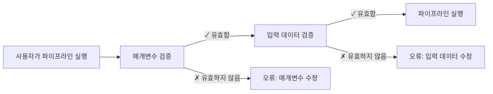

# 파트 5: 입력 검증

<span class="ai-translation-notice">:material-information-outline:{ .ai-translation-notice-icon } AI 지원 번역 - [자세히 알아보기 및 개선 제안](https://github.com/nextflow-io/training/blob/master/TRANSLATING.md)</span>

Hello nf-core 교육 과정의 다섯 번째 파트에서는 nf-schema 플러그인을 사용하여 파이프라인 입력과 매개변수를 검증하는 방법을 보여드립니다.

??? info "이 섹션을 시작하는 방법"

    이 섹션은 [Part 4: Make an nf-core module](./04_make_module.md)을 완료하고 파이프라인의 `COWPY` process 모듈을 nf-core 표준으로 업데이트했다고 가정합니다.

    Part 4를 완료하지 않았거나 이 파트를 새로 시작하고 싶다면, `core-hello-part4` 솔루션을 시작점으로 사용할 수 있습니다.
    `hello-nf-core/` 디렉토리 안에서 다음 명령을 실행하십시오:

    ```bash
    cp -r solutions/core-hello-part4 core-hello
    cd core-hello
    ```

    이렇게 하면 `COWPY` 모듈이 이미 nf-core 표준을 따르도록 업그레이드된 파이프라인을 얻게 됩니다.
    다음 명령을 실행하여 성공적으로 실행되는지 테스트할 수 있습니다:

    ```bash
    nextflow run . --outdir core-hello-results -profile test,docker --validate_params false
    ```

---

## 0. 준비 운동: 배경 지식

### 0.1. 검증이 중요한 이유

파이프라인을 두 시간 동안 실행했는데, 사용자가 잘못된 확장자를 가진 파일을 제공하여 실패하는 상황을 상상해 보십시오. 또는 수수께끼 같은 오류를 디버깅하는 데 몇 시간을 소비한 끝에 매개변수의 철자가 잘못되었다는 것을 발견하는 경우도 있습니다. 입력 검증이 없으면 이러한 시나리오가 흔하게 발생합니다.

다음 예시를 고려해 보십시오:

```console title="검증이 없는 경우"
$ nextflow run my-pipeline --input data.txt --output results

...2시간 후...

ERROR ~ No such file: 'data.fq.gz'
  Expected FASTQ format but received TXT
```

파이프라인이 잘못된 입력을 받아들이고 실패하기 전까지 몇 시간 동안 실행되었습니다. 적절한 검증이 있는 경우:

```console title="검증이 있는 경우"
$ nextflow run my-pipeline --input data.txt --output results

ERROR ~ Validation of pipeline parameters failed!

 * --input (data.txt): File extension '.txt' does not match required pattern '.fq.gz' or '.fastq.gz'
 * --output: required parameter is missing (expected: --outdir)

Pipeline failed before execution - please fix the errors above
```

파이프라인이 명확하고 실행 가능한 오류 메시지와 함께 즉시 실패합니다. 이는 시간, 컴퓨팅 리소스, 그리고 좌절을 절약해 줍니다.

### 0.2. nf-schema 플러그인

[nf-schema 플러그인](https://nextflow-io.github.io/nf-schema/latest/)은 Nextflow 파이프라인에 포괄적인 검증 기능을 제공하는 Nextflow 플러그인입니다.
nf-schema는 모든 Nextflow workflow에서 작동하지만, 모든 nf-core 파이프라인의 표준 검증 솔루션입니다.

nf-schema는 여러 주요 기능을 제공합니다:

- **매개변수 검증**: `nextflow_schema.json`에 대해 파이프라인 매개변수 검증
- **샘플 시트 검증**: `assets/schema_input.json`에 대해 입력 파일 검증
- **채널 변환**: 검증된 샘플 시트를 Nextflow channel로 변환
- **도움말 텍스트 생성**: 스키마 정의로부터 `--help` 출력 자동 생성
- **매개변수 요약**: 기본값과 다른 매개변수를 표시

nf-schema는 더 이상 사용되지 않는 nf-validation 플러그인의 후속 버전이며 검증을 위해 표준 [JSON Schema Draft 2020-12](https://json-schema.org/)를 사용합니다.

??? info "Nextflow 플러그인이란 무엇입니까?"

    플러그인은 Nextflow 언어 자체에 새로운 기능을 추가하는 확장입니다. `nextflow.config`의 `plugins{}` 블록을 통해 설치되며 다음을 제공할 수 있습니다:

    - 가져올 수 있는 새로운 함수와 클래스 (`samplesheetToList`와 같은)
    - 새로운 DSL 기능과 연산자
    - 외부 서비스와의 통합

    nf-schema 플러그인은 `nextflow.config`에 지정됩니다:

    ```groovy
    plugins {
        id 'nf-schema@2.1.1'
    }
    ```

    설치된 후에는 `include { functionName } from 'plugin/plugin-name'` 구문을 사용하여 플러그인에서 함수를 가져올 수 있습니다.

### 0.3. 두 가지 검증 유형을 위한 두 개의 스키마 파일

nf-core 파이프라인은 두 가지 검증 유형에 해당하는 두 개의 별도 스키마 파일을 사용합니다:

| 스키마 파일                | 목적             | 검증 대상                                       |
| -------------------------- | ---------------- | ----------------------------------------------- |
| `nextflow_schema.json`     | 매개변수 검증    | 명령줄 플래그: `--input`, `--outdir`, `--batch` |
| `assets/schema_input.json` | 입력 데이터 검증 | 샘플 시트 및 입력 파일의 내용                   |

두 스키마 모두 JSON Schema 형식을 사용하며, 이는 데이터 구조를 설명하고 검증하기 위해 널리 채택된 표준입니다.

**매개변수 검증**은 명령줄 매개변수(플래그 예: `--outdir`, `--batch`, `--input`)를 검증합니다:

- 매개변수 타입, 범위, 형식 확인
- 필수 매개변수가 제공되었는지 확인
- 파일 경로가 존재하는지 검증
- `nextflow_schema.json`에 정의됨

**입력 데이터 검증**은 샘플 시트 및 매니페스트 파일(데이터를 설명하는 CSV/TSV 파일)의 구조를 검증합니다:

- 컬럼 구조 및 데이터 타입 확인
- 샘플 시트에 참조된 파일 경로가 존재하는지 검증
- 필수 필드가 있는지 확인
- `assets/schema_input.json`에 정의됨

!!! warning "입력 데이터 검증이 하지 않는 것"

    입력 데이터 검증은 *매니페스트 파일*(샘플 시트, CSV 파일)의 구조를 확인하지만 실제 데이터 파일(FASTQ, BAM, VCF 등)의 내용을 검증하지는 않습니다.

    대규모 데이터의 경우, 파일 내용 검증(예: BAM 무결성 확인)은 오케스트레이션 머신의 검증 단계가 아니라 워커 노드에서 실행되는 파이프라인 process에서 수행되어야 합니다.

### 0.4. 검증은 언제 발생해야 합니까?



검증은 파이프라인 process가 실행되기 **전에** 발생하여 빠른 피드백을 제공하고 컴퓨팅 시간 낭비를 방지해야 합니다.

이제 이러한 원칙을 실제로 적용해 보겠습니다. 매개변수 검증부터 시작하겠습니다.

---

## 1. 매개변수 검증 (nextflow_schema.json)

파이프라인에 매개변수 검증을 추가하는 것부터 시작하겠습니다. 이는 `--input`, `--outdir`, `--batch`와 같은 명령줄 플래그를 검증합니다.

### 1.1. 입력 파일 검증을 건너뛰도록 검증 구성

nf-core 파이프라인 템플릿은 이미 nf-schema가 설치되고 구성되어 제공됩니다:

- nf-schema 플러그인은 `nextflow.config`의 `plugins{}` 블록을 통해 설치됩니다
- 매개변수 검증은 `params.validate_params = true`를 통해 기본적으로 활성화됩니다
- 검증은 파이프라인 초기화 중에 `UTILS_NFSCHEMA_PLUGIN` 서브워크플로우에 의해 수행됩니다

검증 동작은 `nextflow.config`의 `validation{}` 범위를 통해 제어됩니다.

매개변수 검증을 먼저 작업할 것이고(이 섹션) 섹션 2까지 입력 데이터 스키마를 구성하지 않을 것이므로, 일시적으로 nf-schema에게 `input` 매개변수의 파일 내용 검증을 건너뛰도록 지시해야 합니다.

`nextflow.config`를 열고 `validation` 블록을 찾으십시오(246줄 근처). 입력 파일 검증을 건너뛰기 위해 `ignoreParams`를 추가하십시오:

=== "수정 후"

    ```groovy title="nextflow.config" hl_lines="3" linenums="246"
    validation {
        defaultIgnoreParams = ["genomes"]
        ignoreParams = ['input']
        monochromeLogs = params.monochrome_logs
    }
    ```

=== "수정 전"

    ```groovy title="nextflow.config" linenums="246"
    validation {
        defaultIgnoreParams = ["genomes"]
        monochromeLogs = params.monochrome_logs
    }
    ```

이 구성은 nf-schema에게 다음을 지시합니다:

- **`defaultIgnoreParams`**: `genomes`와 같은 복잡한 매개변수의 검증 건너뛰기 (템플릿 개발자가 설정)
- **`ignoreParams`**: `input` 매개변수의 파일 내용 검증 건너뛰기 (일시적; 섹션 2에서 다시 활성화할 것임)
- **`monochromeLogs`**: `true`로 설정되면 검증 메시지의 색상 출력 비활성화 (`params.monochrome_logs`로 제어됨)

!!! note "input 매개변수를 무시하는 이유는 무엇입니까?"

    `nextflow_schema.json`의 `input` 매개변수는 `"schema": "assets/schema_input.json"`을 가지고 있어 nf-schema에게 해당 스키마에 대해 입력 CSV 파일의 *내용*을 검증하도록 지시합니다.
    아직 해당 스키마를 구성하지 않았으므로 일시적으로 이 검증을 무시합니다.
    섹션 2에서 입력 데이터 스키마를 구성한 후 이 설정을 제거할 것입니다.

### 1.2. 매개변수 스키마 검토

파이프라인 템플릿과 함께 제공된 `nextflow_schema.json` 파일의 섹션을 살펴보겠습니다:

```bash
grep -A 25 '"input_output_options"' nextflow_schema.json
```

매개변수 스키마는 그룹으로 구성됩니다. 다음은 `input_output_options` 그룹입니다:

```json title="core-hello/nextflow_schema.json (발췌)" linenums="8"
        "input_output_options": {
            "title": "Input/output options",
            "type": "object",
            "fa_icon": "fas fa-terminal",
            "description": "Define where the pipeline should find input data and save output data.",
            "required": ["input", "outdir"],
            "properties": {
                "input": {
                    "type": "string",
                    "format": "file-path",
                    "exists": true,
                    "schema": "assets/schema_input.json",
                    "mimetype": "text/csv",
                    "pattern": "^\\S+\\.csv$",
                    "description": "Path to comma-separated file containing information about the samples in the experiment.",
                    "help_text": "You will need to create a design file with information about the samples in your experiment before running the pipeline. Use this parameter to specify its location. It has to be a comma-separated file with 3 columns, and a header row.",
                    "fa_icon": "fas fa-file-csv"
                },
                "outdir": {
                    "type": "string",
                    "format": "directory-path",
                    "description": "The output directory where the results will be saved. You have to use absolute paths to storage on Cloud infrastructure.",
                    "fa_icon": "fas fa-folder-open"
                }
            }
        },
```

여기에 설명된 각 입력은 검증할 수 있는 다음과 같은 주요 속성을 가지고 있습니다:

- **`type`**: 데이터 타입 (string, integer, boolean, number)
- **`format`**: `file-path` 또는 `directory-path`와 같은 특수 형식
- **`exists`**: 파일 경로의 경우 파일이 존재하는지 확인
- **`pattern`**: 값이 일치해야 하는 정규 표현식
- **`required`**: 제공되어야 하는 매개변수 이름의 배열
- **`mimetype`**: 검증을 위해 예상되는 파일 mimetype

예리한 눈을 가지고 있다면, 우리가 사용해 온 `batch` 입력 매개변수가 아직 스키마에 정의되지 않았다는 것을 알아차릴 수 있습니다.
다음 섹션에서 추가하겠습니다.

??? info "스키마 매개변수는 어디에서 왔습니까?"

    스키마 검증은 `nextflow.config`를 매개변수 정의의 기본으로 사용합니다.
    workflow 스크립트의 다른 곳(`main.nf` 또는 모듈 파일)에서 선언된 매개변수는 스키마 검증기에 의해 자동으로 **인식되지 않습니다**.

    이는 항상 `nextflow.config`에서 파이프라인 매개변수를 선언한 다음 `nextflow_schema.json`에서 검증 규칙을 정의해야 함을 의미합니다.

### 1.3. batch 매개변수 추가

스키마는 수동으로 편집할 수 있는 JSON 파일이지만, **수동 편집은 오류가 발생하기 쉽고 권장되지 않습니다**.
대신 nf-core는 JSON Schema 구문을 처리하고 변경 사항을 검증하는 대화형 GUI 도구를 제공합니다:

```bash
nf-core pipelines schema build
```

다음과 같은 내용이 표시될 것입니다:

```console
                                      ,--./,-.
      ___     __   __   __   ___     /,-._.--\
|\ | |__  __ /  ` /  \ |__) |__         }  {
| \| |       \__, \__/ |  \ |___     \`-._,-`-,
                                      `._,._,'

nf-core/tools version 3.4.1 - https://nf-co.re

INFO     [✓] Default parameters match schema validation
INFO     [✓] Pipeline schema looks valid (found 17 params)
INFO     Writing schema with 17 params: 'nextflow_schema.json'
🚀  Launch web builder for customisation and editing? [y/n]:
```

`y`를 입력하고 Enter를 눌러 대화형 웹 인터페이스를 실행하십시오.

브라우저가 열리면서 Parameter schema builder가 표시됩니다:


`batch` 매개변수를 추가하려면:

1. 상단의 **"Add parameter"** 버튼을 클릭하십시오
2. 드래그 핸들(⋮⋮)을 사용하여 새 매개변수를 "Input/output options" 그룹으로 `input` 매개변수 아래로 이동시키십시오
3. 매개변수 세부 정보를 입력하십시오:
   - **ID**: `batch`
   - **Description**: `Name for this batch of greetings`
   - **Type**: `string`
   - **Required**: 체크박스 선택
   - 선택적으로, 아이콘 선택기에서 아이콘 선택 (예: `fas fa-layer-group`)


완료되면 오른쪽 상단의 **"Finished"** 버튼을 클릭하십시오.

터미널로 돌아가면 다음이 표시됩니다:

```console
INFO     Writing schema with 18 params: 'nextflow_schema.json'
⣾ Use ctrl+c to stop waiting and force exit.
```

`Ctrl+C`를 눌러 schema builder를 종료하십시오.

이제 도구가 새로운 `batch` 매개변수로 `nextflow_schema.json` 파일을 업데이트했으며, 모든 JSON Schema 구문을 올바르게 처리했습니다.

### 1.4. 변경 사항 확인

```bash
grep -A 25 '"input_output_options"' nextflow_schema.json
```

```json title="core-hello/nextflow_schema.json (발췌)" linenums="8" hl_lines="19-23"
    "input_output_options": {
      "title": "Input/output options",
      "type": "object",
      "fa_icon": "fas fa-terminal",
      "description": "Define where the pipeline should find input data and save output data.",
      "required": ["input", "outdir", "batch"],
      "properties": {
        "input": {
          "type": "string",
          "format": "file-path",
          "exists": true,
          "schema": "assets/schema_input.json",
          "mimetype": "text/csv",
          "pattern": "^\\S+\\.csv$",
          "description": "Path to comma-separated file containing information about the samples in the experiment.",
          "help_text": "You will need to create a design file with information about the samples in your experiment before running the pipeline. Use this parameter to specify its location. It has to be a comma-separated file with 3 columns, and a header row.",
          "fa_icon": "fas fa-file-csv"
        },
        "batch": {
          "type": "string",
          "description": "Name for this batch of greetings",
          "fa_icon": "fas fa-layer-group"
        },
```

`batch` 매개변수가 스키마에 추가되었고 "required" 필드가 이제 `["input", "outdir", "batch"]`를 표시하는 것을 확인할 수 있습니다.

### 1.5. 매개변수 검증 테스트

이제 매개변수 검증이 올바르게 작동하는지 테스트해 보겠습니다.

먼저 필수 `input` 매개변수 없이 실행해 보십시오:

```bash
nextflow run . --outdir test-results -profile docker
```

??? warning "명령 출력"

    ```console
    ERROR ~ Validation of pipeline parameters failed!

    -- Check '.nextflow.log' file for details
    The following invalid input values have been detected:

    * Missing required parameter(s): input, batch
    ```

완벽합니다! 검증이 파이프라인이 실행되기 전에 누락된 필수 매개변수를 잡아냅니다.

이제 유효한 매개변수 세트로 시도해 보십시오:

```bash
nextflow run . --input assets/greetings.csv --outdir results --batch my-batch -profile test,docker
```

??? success "명령 출력"

    ```console
     N E X T F L O W   ~  version 25.04.3

    Launching `./main.nf` [peaceful_wozniak] DSL2 - revision: b9e9b3b8de

    executor >  local (8)
    [de/a1b2c3] CORE_HELLO:HELLO:sayHello (3)       | 3 of 3 ✔
    [4f/d5e6f7] CORE_HELLO:HELLO:convertToUpper (3) | 3 of 3 ✔
    [8a/b9c0d1] CORE_HELLO:HELLO:CAT_CAT (test)     | 1 of 1 ✔
    [e2/f3a4b5] CORE_HELLO:HELLO:COWPY (test)       | 1 of 1 ✔
    -[core/hello] Pipeline completed successfully-
    ```

파이프라인이 성공적으로 실행되어야 하며 `batch` 매개변수가 이제 검증됩니다.

### 정리

대화형 `nf-core pipelines schema build` 도구를 사용하여 `nextflow_schema.json`에 매개변수를 추가하는 방법을 배웠고 실제로 매개변수 검증을 확인했습니다.
웹 인터페이스가 모든 JSON Schema 구문을 처리해 주므로 오류가 발생하기 쉬운 수동 JSON 편집 없이도 복잡한 매개변수 스키마를 쉽게 관리할 수 있습니다.

### 다음 단계는?

이제 매개변수 검증이 작동하니 입력 데이터 파일 내용에 대한 검증을 추가해 보겠습니다.

---

## 2. 입력 데이터 검증 (schema_input.json)

입력 CSV 파일의 내용에 대한 검증을 추가하겠습니다.
매개변수 검증이 명령줄 플래그를 확인하는 반면, 입력 데이터 검증은 CSV 파일 내부의 데이터가 올바르게 구조화되었는지 확인합니다.

### 2.1. greetings.csv 형식 이해

입력이 어떻게 생겼는지 다시 살펴보겠습니다:

```bash
cat assets/greetings.csv
```

```csv title="assets/greetings.csv"
Hello,en,87
Bonjour,fr,96
Holà,es,98
```

이것은 다음과 같은 간단한 CSV입니다:

- 세 개의 컬럼 (헤더 없음)
- 각 줄에: 인사말, 언어, 점수
- 처음 두 컬럼은 특별한 형식 요구 사항이 없는 텍스트 문자열
- 세 번째 컬럼은 정수

우리 파이프라인의 경우 첫 번째 컬럼만 필수입니다.

### 2.2. 스키마 구조 설계

우리의 사용 사례에서는 다음을 원합니다:

1. 최소 하나의 컬럼을 가진 CSV 입력 허용
2. 각 행의 첫 번째 요소를 인사말 문자열로 취급
3. 인사말이 비어 있지 않고 공백으로 시작하지 않는지 확인
4. 언어 필드가 지원되는 언어 코드 중 하나와 일치하는지 확인 (en, fr, es, it, de)
5. 점수 필드가 0에서 100 사이의 값을 가진 정수인지 확인

이를 객체 배열로 구조화하며, 각 객체는 최소한 `greeting` 필드를 가집니다.

### 2.3. 스키마 파일 업데이트

nf-core 파이프라인 템플릿은 paired-end 시퀀싱 데이터를 위해 설계된 기본 `assets/schema_input.json`을 포함합니다.
이를 우리의 인사말 사용 사례에 맞는 더 간단한 스키마로 교체해야 합니다.

`assets/schema_input.json`을 열고 `properties`와 `required` 섹션을 교체하십시오:

=== "수정 후"

    ```json title="assets/schema_input.json" linenums="1" hl_lines="10-25 27"
    {
        "$schema": "https://json-schema.org/draft/2020-12/schema",
        "$id": "https://raw.githubusercontent.com/core/hello/main/assets/schema_input.json",
        "title": "core/hello pipeline - params.input schema",
        "description": "Schema for the greetings file provided with params.input",
        "type": "array",
        "items": {
            "type": "object",
            "properties": {
                "greeting": {
                    "type": "string",
                    "pattern": "^\\S.*$",
                    "errorMessage": "Greeting must be provided and cannot be empty or start with whitespace"
                },
                "language": {
                    "type": "string",
                    "enum": ["en", "fr", "es", "it", "de"],
                    "errorMessage": "Language must be one of: en, fr, es, it, de"
                },
                "score": {
                    "type": "integer",
                    "minimum": 0,
                    "maximum": 100,
                    "errorMessage": "Score must be an integer with a value between 0 and 100"
                }
            },
            "required": ["greeting"]
        }
    }
    ```

=== "수정 전"

    ```json title="assets/schema_input.json" linenums="1" hl_lines="10-29 31"
    {
        "$schema": "https://json-schema.org/draft/2020-12/schema",
        "$id": "https://raw.githubusercontent.com/core/hello/main/assets/schema_input.json",
        "title": "core/hello pipeline - params.input schema",
        "description": "Schema for the file provided with params.input",
        "type": "array",
        "items": {
            "type": "object",
            "properties": {
                "sample": {
                    "type": "string",
                    "pattern": "^\\S+$",
                    "errorMessage": "Sample name must be provided and cannot contain spaces",
                    "meta": ["id"]
                },
                "fastq_1": {
                    "type": "string",
                    "format": "file-path",
                    "exists": true,
                    "pattern": "^([\\S\\s]*\\/)?[^\\s\\/]+\\.f(ast)?q\\.gz$",
                    "errorMessage": "FastQ file for reads 1 must be provided, cannot contain spaces and must have extension '.fq.gz' or '.fastq.gz'"
                },
                "fastq_2": {
                    "type": "string",
                    "format": "file-path",
                    "exists": true,
                    "pattern": "^([\\S\\s]*\\/)?[^\\s\\/]+\\.f(ast)?q\\.gz$",
                    "errorMessage": "FastQ file for reads 2 cannot contain spaces and must have extension '.fq.gz' or '.fastq.gz'"
                }
            },
            "required": ["sample", "fastq_1"]
        }
    }
    ```

주요 변경 사항:

- **`description`**: "greetings file"을 언급하도록 업데이트
- **`properties`**: `sample`, `fastq_1`, `fastq_2`를 `greeting`, `language`, `score`로 교체
  - **`type:`** string (`greeting`, `language`) 또는 integer (`score`) 적용
  - **`pattern: "^\\S.*$"`**: 인사말은 공백이 아닌 문자로 시작해야 함 (하지만 그 이후에는 공백을 포함할 수 있음)
  - **`"enum": ["en", "fr", "es", "it", "de"]`**: 언어 코드는 지원되는 세트에 있어야 함
  - **`"minimum": 0` 및 `"maximum": 100`**: 점수 값은 0에서 100 사이여야 함
  - **`errorMessage`**: 검증이 실패하면 표시되는 사용자 지정 오류 메시지
- **`required`**: `["sample", "fastq_1"]`에서 `["greeting"]`으로 변경

### 2.4. greetings.csv 파일에 헤더 추가

nf-schema가 CSV 파일을 읽을 때, 스키마의 필드 이름과 일치하는 컬럼 헤더가 첫 번째 행에 있어야 합니다.

우리의 간단한 경우, 인사말 파일에 헤더 라인을 추가해야 합니다:

=== "수정 후"

    ```csv title="assets/greetings.csv" linenums="1" hl_lines="1"
    greeting,language,score
    Hello,en,87
    Bonjour,fr,96
    Holà,es,98
    ```

=== "수정 전"

    ```csv title="assets/greetings.csv" linenums="1"
    Hello,en,87
    Bonjour,fr,96
    Holà,es,98
    ```

이제 CSV 파일에 스키마의 필드 이름과 일치하는 헤더 라인이 있습니다.

마지막 단계는 `samplesheetToList`를 사용하여 파이프라인 코드에서 검증을 구현하는 것입니다.

### 2.5. 파이프라인에서 검증 구현

이제 간단한 CSV 파싱을 nf-schema의 `samplesheetToList` 함수로 교체해야 합니다. 이 함수는 samplesheet를 검증하고 파싱합니다.

`samplesheetToList` 함수는:

1. 입력 샘플 시트를 읽음 (CSV, TSV, JSON, 또는 YAML)
2. 제공된 JSON 스키마에 대해 검증
3. 각 항목이 행에 해당하는 Groovy 리스트를 반환
4. 검증이 실패하면 도움이 되는 오류 메시지를 발생시킴

입력 처리 코드를 업데이트해 보겠습니다:

`subworkflows/local/utils_nfcore_hello_pipeline/main.nf`를 열고 입력 channel을 생성하는 섹션을 찾으십시오(80줄 근처).

다음을 수행해야 합니다:

1. `samplesheetToList` 함수 사용 (템플릿에 이미 import됨)
2. 입력 검증 및 파싱
3. workflow를 위해 인사말 문자열만 추출

먼저 `samplesheetToList` 함수가 파일 상단에 이미 import되어 있음을 확인하십시오 (nf-core 템플릿에 기본적으로 포함됨):

```groovy title="core-hello/subworkflows/local/utils_nfcore_hello_pipeline/main.nf" linenums="1" hl_lines="13"
//
// core/hello 파이프라인 전용 기능을 가진 서브워크플로우
//

/*
~~~~~~~~~~~~~~~~~~~~~~~~~~~~~~~~~~~~~~~~~~~~~~~~~~~~~~~~~~~~~~~~~~~~~~~~~~~~~~~~~~~~~~~~
    IMPORT FUNCTIONS / MODULES / SUBWORKFLOWS
~~~~~~~~~~~~~~~~~~~~~~~~~~~~~~~~~~~~~~~~~~~~~~~~~~~~~~~~~~~~~~~~~~~~~~~~~~~~~~~~~~~~~~~~
*/

include { UTILS_NFSCHEMA_PLUGIN     } from '../../nf-core/utils_nfschema_plugin'
include { paramsSummaryMap          } from 'plugin/nf-schema'
include { samplesheetToList         } from 'plugin/nf-schema'
include { paramsHelp                } from 'plugin/nf-schema'
include { completionSummary         } from '../../nf-core/utils_nfcore_pipeline'
include { UTILS_NFCORE_PIPELINE     } from '../../nf-core/utils_nfcore_pipeline'
include { UTILS_NEXTFLOW_PIPELINE   } from '../../nf-core/utils_nextflow_pipeline'
```

이제 channel 생성 코드를 업데이트하십시오:

=== "수정 후"

    ```groovy title="core-hello/subworkflows/local/utils_nfcore_hello_pipeline/main.nf" linenums="80" hl_lines="4"
        //
        // params.input을 통해 제공된 입력 파일에서 채널 생성
        //
        ch_samplesheet = channel.fromList(samplesheetToList(params.input, "${projectDir}/assets/schema_input.json"))
            .map { line -> line[0] }

        emit:
        samplesheet = ch_samplesheet
        versions    = ch_versions
    ```

=== "수정 전"

    ```groovy title="core-hello/subworkflows/local/utils_nfcore_hello_pipeline/main.nf" linenums="80" hl_lines="4 5"
        //
        // params.input을 통해 제공된 입력 파일에서 채널 생성
        //
        ch_samplesheet = channel.fromPath(params.input)
            .splitCsv()
            .map { line -> line[0] }

        emit:
        samplesheet = ch_samplesheet
        versions    = ch_versions
    ```

변경된 내용을 분석해 보겠습니다:

1. **`samplesheetToList(params.input, "${projectDir}/assets/schema_input.json")`**: 스키마에 대해 입력 파일을 검증하고 리스트를 반환
2. **`Channel.fromList(...)`**: 리스트를 Nextflow channel로 변환

이것으로 `samplesheetToList`와 JSON 스키마를 사용한 입력 데이터 검증의 구현이 완료됩니다.

이제 입력 데이터 스키마를 구성했으므로, 앞서 추가한 임시 무시 설정을 제거할 수 있습니다.

### 2.6. 입력 검증 재활성화

`nextflow.config`를 열고 `validation` 블록에서 `ignoreParams` 라인을 제거하십시오:

=== "수정 후"

    ```groovy title="nextflow.config" linenums="246"
    validation {
        defaultIgnoreParams = ["genomes"]
        monochromeLogs = params.monochrome_logs
    }
    ```

=== "수정 전"

    ```groovy title="nextflow.config" hl_lines="3" linenums="246"
    validation {
        defaultIgnoreParams = ["genomes"]
        ignoreParams = ['input']
        monochromeLogs = params.monochrome_logs
    }
    ```

이제 nf-schema는 매개변수 타입과 입력 파일 내용을 모두 검증할 것입니다.

### 2.7. 입력 검증 테스트

유효한 입력과 유효하지 않은 입력을 모두 테스트하여 검증이 작동하는지 확인해 보겠습니다.

#### 2.7.1. 유효한 입력으로 테스트

먼저 유효한 입력으로 파이프라인이 성공적으로 실행되는지 확인하십시오.
검증이 작동하므로 더 이상 `--validate_params false`가 필요하지 않습니다!

```bash
nextflow run . --outdir core-hello-results -profile test,docker
```

??? success "명령 출력"

    ```console
    ------------------------------------------------------
    WARN: The following invalid input values have been detected:

    * --character: tux


    executor >  local (8)
    [c1/39f64a] CORE_HELLO:HELLO:sayHello (1)       | 3 of 3 ✔
    [44/c3fb82] CORE_HELLO:HELLO:convertToUpper (3) | 3 of 3 ✔
    [62/80fab2] CORE_HELLO:HELLO:CAT_CAT (test)     | 1 of 1 ✔
    [e1/4db4fd] CORE_HELLO:HELLO:COWPY (test)       | 1 of 1 ✔
    -[core/hello] Pipeline completed successfully-
    ```

훌륭합니다! 파이프라인이 성공적으로 실행되고 검증이 조용히 통과합니다.
`--character`에 대한 경고는 스키마에 정의되지 않았기 때문에 정보 제공용입니다.
원한다면 배운 것을 사용하여 해당 매개변수에 대한 검증도 추가할 수 있습니다!

#### 2.7.2. 유효하지 않은 입력으로 테스트

검증 통과는 항상 기분 좋지만, 검증이 실제로 오류를 잡아내는지 확인해 보겠습니다.

유효하지 않은 컬럼 이름을 가진 테스트 파일을 만들기 위해 먼저 `greetings.csv` 파일의 복사본을 만드십시오:

```bash
cp assets/greetings.csv assets/invalid_greetings.csv
```

이제 파일을 열고 헤더 라인에서 첫 번째 컬럼의 이름을 `greeting`에서 `message`로 변경하십시오:

=== "수정 후"

    ```csv title="tmp_invalid_greetings.csv" hl_lines="1" linenums="1"
    message,language,score
    Hello,en,87
    Bonjour,fr,96
    Holà,es,98
    ```

=== "수정 전"

    ```csv title="tmp_invalid_greetings.csv" hl_lines="1" linenums="1"
    greeting,language,score
    Hello,en,87
    Bonjour,fr,96
    Holà,es,98
    ```

이것은 스키마와 일치하지 않으므로 검증에서 오류를 발생시켜야 합니다.

이 유효하지 않은 입력으로 파이프라인을 실행해 보십시오:

```bash
nextflow run . --input assets/invalid_greetings.csv --outdir test-results -profile docker
```

??? failure "명령 출력"

    ```console
    N E X T F L O W   ~  version 24.10.4

    Launching `./main.nf` [trusting_ochoa] DSL2 - revision: b9e9b3b8de

    Input/output options
      input              : assets/invalid_greetings.csv
      outdir             : test-results

    Generic options
      trace_report_suffix: 2025-01-27_03-16-04

    Core Nextflow options
      runName            : trusting_ochoa
      containerEngine    : docker
      launchDir          : /workspace/hello-nf-core
      workDir            : /workspace/hello-nf-core/work
      projectDir         : /workspace/hello-nf-core
      userName           : user
      profile            : docker
      configFiles        : /workspace/hello-nf-core/nextflow.config

    !! Only displaying parameters that differ from the pipeline defaults !!
    ------------------------------------------------------
    ERROR ~ Validation of pipeline parameters failed!

     -- Check '.nextflow.log' file for details
    The following invalid input values have been detected:

    * Missing required parameter(s): batch
    * --input (assets/invalid_greetings.csv): Validation of file failed:
        -> Entry 1: Missing required field(s): greeting
        -> Entry 2: Missing required field(s): greeting
        -> Entry 3: Missing required field(s): greeting

     -- Check script 'subworkflows/nf-core/utils_nfschema_plugin/main.nf' at line: 68 or see '.nextflow.log' file for more details
    ```

완벽합니다! 검증이 오류를 잡아내고 다음을 가리키는 명확하고 도움이 되는 오류 메시지를 제공했습니다:

- 어떤 파일의 검증이 실패했는지
- 어떤 항목(첫 번째 데이터 행인 row 1)에 문제가 있는지
- 구체적인 문제가 무엇인지 (필수 필드 `greeting` 누락)

스키마 검증은 파이프라인이 실행되기 전에 입력 파일이 올바른 구조를 가지고 있는지 확인하여 시간을 절약하고 나중에 실행 중 혼란스러운 오류를 방지합니다.

연습하고 싶다면 스키마를 다른 재미있는 방식으로 위반하는 다른 인사말 입력 파일을 자유롭게 만들어 보십시오.

### 정리

매개변수 검증과 입력 데이터 검증을 모두 구현하고 테스트했습니다. 파이프라인이 이제 실행 전에 입력을 검증하여 빠른 피드백과 명확한 오류 메시지를 제공합니다.

!!! tip "추가 읽을거리"

    고급 검증 기능과 패턴에 대해 자세히 알아보려면 [nf-schema 문서](https://nextflow-io.github.io/nf-schema/latest/)를 확인하십시오. `nf-core pipelines schema build` 명령은 복잡한 스키마를 관리하기 위한 대화형 GUI를 제공합니다.

### 다음 단계는?

Hello nf-core 교육 과정의 다섯 개 파트를 모두 완료했습니다!

[Summary](summary.md)로 계속 진행하여 구축하고 배운 내용을 돌아보십시오.
